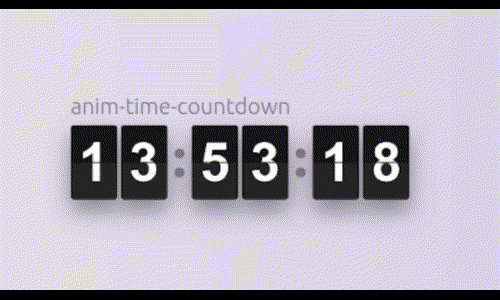

# Anim Time Countdown

## Usage guide

import TimeCountDown from "anim-time-countdown";

## Props

|                |Default value                          |Value type                         |
|----------------|-------------------------------|-----------------------------|
|classes|`undefined`|Classnames|
|defaultValueSeconds|`'0'`|number|
|numberStyles|`undefined`|Styles|
|onTimeout|`undefined`|(newValue) => void|

## Classnames

|                |Info                                                   |
|----------------|-------------------------------|
|classes.container|`Container`|
|classes.wrapper|`Wrapper of counter item`|
|classes.numberClasses.root|`Root of number item`|
|classes.numberClasses.topSide|`Top side of number item`|
|classes.numberClasses.bottomSide|`Bottom side of number item`|

## Styles

|                |Info                                                   |
|----------------|-------------------------------|
|bgColor|`Number background color`|
|color|`Number color`|
|fontSize|`Number font size`|
|height|`Number height`|
|sideBottomBgColor|`Background color of bottom side`|
|width|`Number width`|